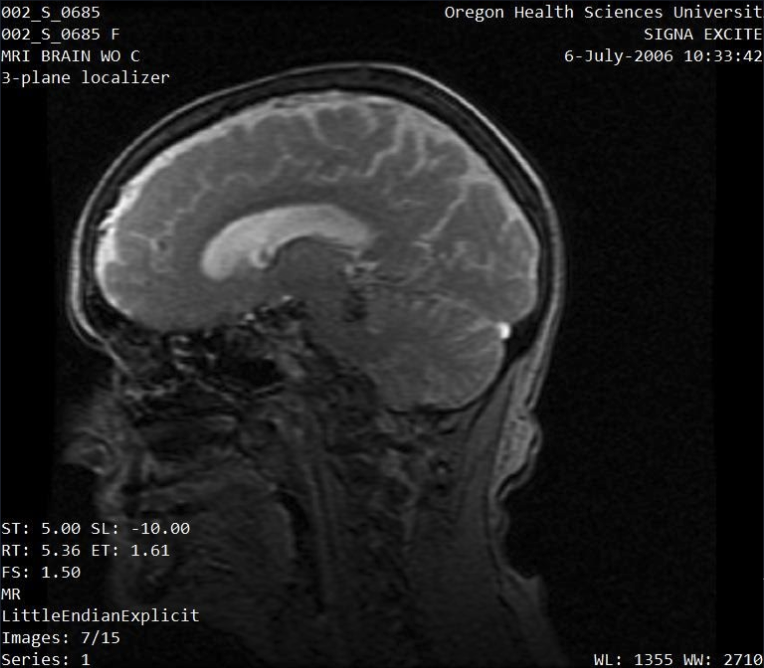
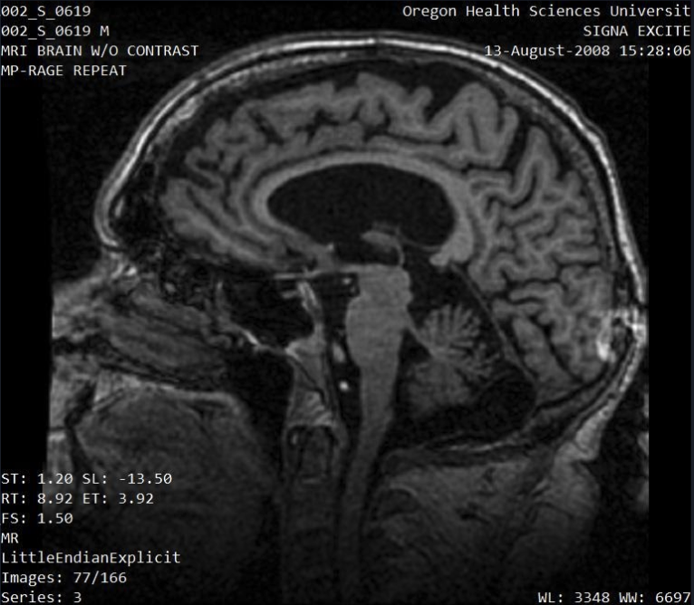
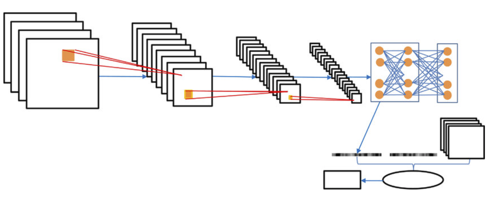
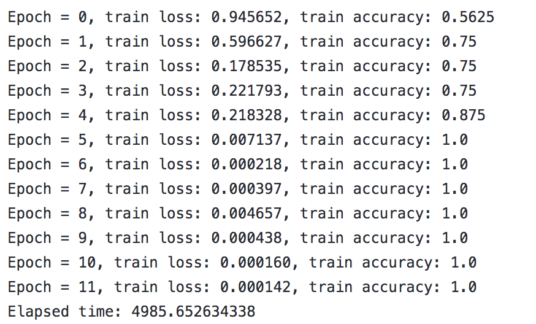
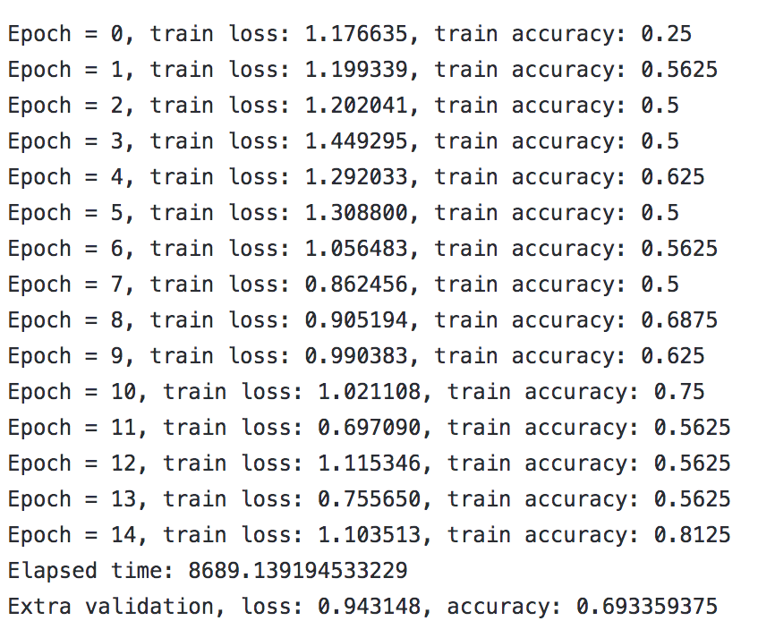
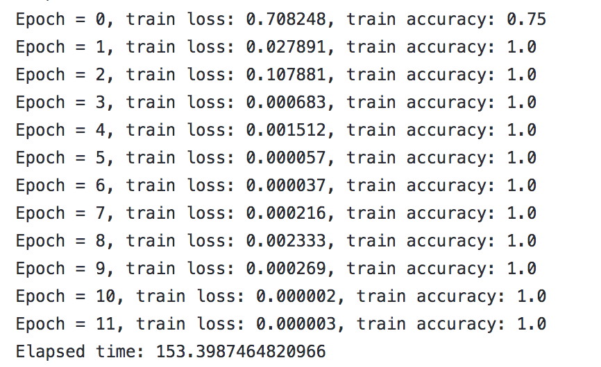
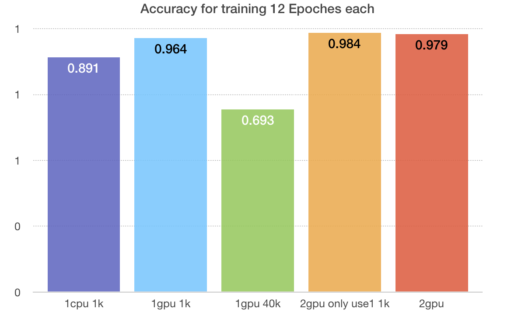

# CS596Fall2021FinalProject
Zhaopu Chen, Donghao Feng, Zunqi Huang, John Lin, Twinkle Lok, Xinrui Lyu, Siyi Song

## 1. Background Introduction:

Alzheimer’s disease, the most common form of dementia, has challenged human beings for centuries. This disease is a brain disorder that slowly destroys memory and thinking skills and, eventually, the ability to carry out the simplest tasks. In most people with the disease — those with the late-onset type symptoms first appear in their mid-60s.
An early detection would be a great strategy for patients to slow or prevent disease progression:
1. Rule Out Reversible and Treatable Causes of Dementia
2. More Opportunities to Participate in Clinical Trials
3. Medications Are Often More Effective in Early Alzheimer's
4. Non-Drug Interventions Can Also Delay and Slow Progression

Beacause of these benefits, our group would like to use deep learning approaches to help detect for the early stage of Alzheimer's disease. The basic idea is that we will use a lot of dcm images of brain to train a model, the model we plan to use is Pytorch. In the end, the expected results is to train the ML model and the estimated success rate of images recognition between normal human brain and Alzheimer’s disease can reach at least 80%.

## 2. Data Set:

- Human brain MRI images
- Main differences between patients and healthy individuals: brain volume
- Source: Alzheimer's Disease Neuroimaging Initiative (ADNI) from USC's Mark and Mary Stevens Neuroimaging and Informatics Institute 

## 3. Cognitive normal vs Alzheimer’s disease:

 

## 4. Model:

1. Pytorch wirh Pydicom package
   Pydicom is used to convert the medicial images into the format that PyTorch can be used
2. CNN
3. IDE: Jupyter lab
4. USC CARC 
   CARC is used for training the model with parallel GPU and CPU

## 5. Expected Results:

Train the ML model successfully and the estimated success rate of images recognition between normal human brain and Alzheimer’s disease is at least 80%. When a random image of brain feed to the model, it can make a decision if this is a healthy person or not.

## 6. Implementation:

1. Data cleaning:
    The raw data is divided into three parts: training data set, validation data set and testing data set. Each part of the data consists of patient's data(AD) and normal person's data(CN). For multiple MRI images of the same person, we clean up data and only take 15% of pictures in the middle, so that the difference between CN's pictures and AD's pictures is greater.
2. Train ML model using 2D-convolutional neural network 
3. Verify the model

## 7. Result Display:
1. Using 1 cpu with 1k samples. By using cpu the accuracy is around 0.9 but the elapsed time is really high.

2. Using 1 gpu with 40k samples. With higher drop out rate and more transformations Lower accuracies overall but more generalizable. Needs more epochs for better accuracies.

3. Using 2 gpu with 1k samples. Have higher accuracies overall.

4. Compare of accuracy for training 12 Epoches

5. Compare of time taken for training 12 Epoches in seconds

The detailed training result shows in the result.

 ## 8. Conclusion and Evaluation 

From the result, we can see that training with two GPU is slower than one GPU.
The possible reason can be 
1. Due to different models have different scalability. Different scalability is due to the overhead of weight synchronization.
2. The batches are too small, all the time is spend in cuda memory allocation.

